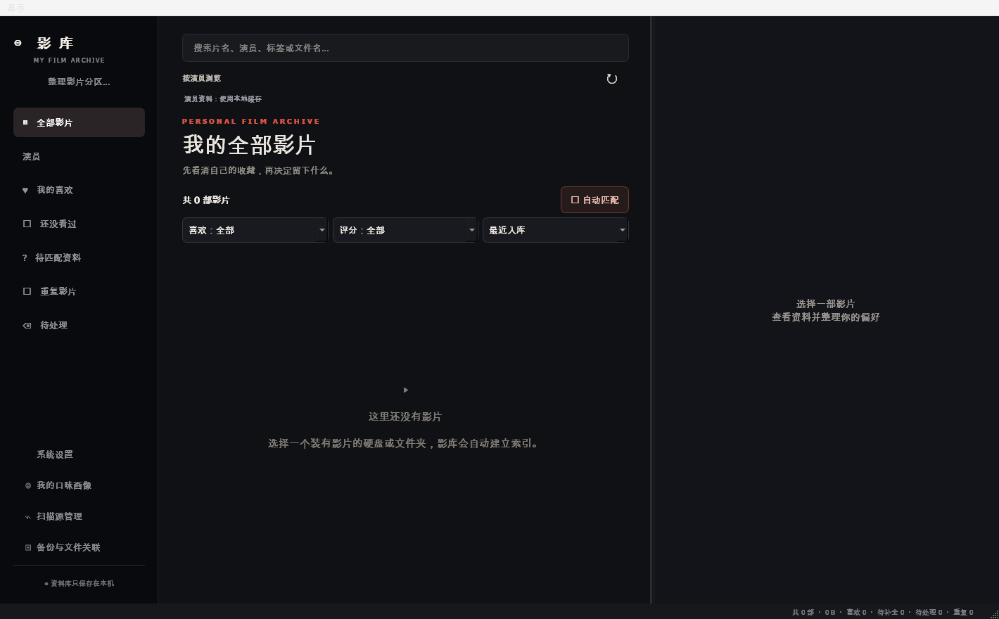

# 影库 YingKu

**本地优先的私人影视资料库** — 数据完全留在你的电脑上，双分区隐私隔离，Windows Hello 生物识别保护。原生 Qt 桌面应用，无浏览器外壳，无云端依赖。




---

## 为什么选择影库

### 隐私分区，而非简单的密码锁

影库设计了**普通 / 隐私双资料库**：两个分区各自拥有独立的影片记录、演员资料、图片缓存与收藏，存储在 `%LOCALAPPDATA%` 的不同目录中。隐私模式的进入由系统级身份验证把关——绑定应用窗口的 **Windows Hello**（面容 / 指纹 / PIN），硬件不支持时回退到当前 Windows 用户凭据验证，并校验登录令牌 SID 与当前用户一致，**不接受其他账户、不保存任何凭据**。取消验证只能保持普通模式，取消不能解锁。

### 本地优先，数据自主

全部资料库存储在本地 SQLite 数据库中。影片文件**永远保持原位置**，通过 Windows 文件属性隐藏实现"眼不见"，移除扫描源或关闭隐藏后自动恢复原始属性。不依赖任何云端服务，导出、备份、迁移完全由你自己掌控。

### 原生桌面体验

基于 PySide6 / Qt 构建，是真正的原生 Windows 桌面程序——不是 Electron，也不是浏览器套壳。整体纵向滚动与顶部固定筛选、沉浸式详情页、横竖窗口布局记忆、全屏支持、覆盖式滚动条，每个交互细节都按桌面习惯打磨。随包自带 Python 运行时、Qt 与 FFmpeg，用户侧**零安装**。

### 工程化交付，可验证、可复现

这不是一个"能跑就行"的项目——每个交付物都有对应的质量证据：

| 质量环节 | 状态 |
|---------|------|
| 回归测试 | Windows 176 项：167 通过 / 9 项按平台跳过；跨平台源码回归 175 项 |
| 启动验证 | 交付 exe 四场景实测：取消验证→普通模式、验证成功→隐私模式、启动扫描、后台任务失败恢复 |
| 完整性保障 | 321 个交付文件全部附带 SHA256 校验值 |
| 依赖管理 | 锁定依赖版本（requirements-windows-lock.txt），附带离线安装器与依赖包 |
| 构建复现 | PyInstaller spec + 一键构建脚本 + GitHub Actions CI 模板 |

---

## 功能全景

| 模块 | 能力 |
|------|------|
| **影片管理** | 目录自动扫描、本地 NFO 元数据匹配、封面墙、五星评分、喜欢 / 收藏、观看状态与播放次数、重复影片识别、文件指纹关联恢复 |
| **演员系统** | 演员头像、中文名、照片候选、人物资料缓存、演员收藏与管理；对接 TVmaze / Bangumi / Jikan 公开资料源，按已核实编号关联，不用重名顶替 |
| **浏览体验** | 沉浸式详情页、关键截图预览（键盘 `←` `→` 翻页）、全库筛选计数、整体滚动 + 顶部固定筛选、布局与窗口状态记忆 |
| **搜索** | 全局搜索（片名 / 演员 / 标签 / 文件名）、自定义 `<name>` 网页搜索模板（百度 / 豆瓣 / IMDb 格式，自动编码中文与特殊字符） |
| **数据安全** | 完整备份与校验预览、恢复前自动备份、失败自动回滚、移动到回收站、同库单实例保护 |
| **文件治理** | 时长过滤扫描、入库后隐藏（标准 / 系统 + 隐藏两种模式）、移除来源时安全恢复属性、缺失文件确认式重新关联 |
| **隐私分区** | 普通 / 隐私双资料库完全隔离、Windows Hello 验证、共享搜索设置独立保存、分区间备份不混用 |

---

## 快速开始

### 普通用户

从 [Releases](https://github.com/suncry/myVideo/releases) 下载 `YingKu-v2.8.2-Runtime.zip`（约 73 MB），解压后双击 `影库.exe` 即可运行——无需安装 Python、Qt 或 FFmpeg。

```
1. 解压压缩包（保留 _internal 文件夹，不要只复制单个 exe）
2. 双击 01-运行版\影库.exe
3. 首次启动验证 Windows 用户 —— 取消进入普通模式，验证成功进入隐私模式
4. 在「扫描源管理」中添加影片所在目录，开始扫描
```

资料库位置：`%LOCALAPPDATA%\YingKu`（隐私）、`%LOCALAPPDATA%\YingKu-Public`（普通），共享搜索设置位于 `%LOCALAPPDATA%\YingKu-Settings.sqlite3`。升级运行版不会覆盖这些目录。

### 开发者

```powershell
git clone https://github.com/suncry/myVideo.git
cd myVideo/02-完整源码

开发环境准备.bat        # 安装 Python 3.12 x64 并创建项目环境（支持离线安装）
源码启动.bat            # 运行可修改的版本
运行测试.bat            # 自动使用隔离资料库，不触碰真实数据
生成Windows运行版.bat    # 测试通过后构建 exe
```

技术栈：**Python 3.12 · PySide6 6.8.3 / Qt · SQLite · FFmpeg 7.1（随包）**。持续集成模板见 `.github/workflows/windows-build.yml`，可在自己的仓库手动触发。

---

## 仓库结构

```
myVideo/
├── 01-运行版/            # 免安装交付：影库.exe + 自带 Python/Qt/FFmpeg
├── 02-完整源码/          # 全部源码、测试、构建脚本、锁定依赖、CI 模板
├── 03-开发文档/          # 项目结构 · 开发接续说明 · 验证说明
├── 04-验证记录/          # 测试日志 · 启动场景截图 · 组件检查 JSON
├── 05-离线开发环境/      # Python 3.12 离线安装器 + 19 个锁定依赖包
├── 先读这里.md            # 用户使用入门
└── 文件校验.json          # 全部 321 个交付文件的 SHA256 校验值
```

核心源码模块（详见 [03-开发文档/项目结构.md](03-开发文档/项目结构.md)）：

| 模块 | 职责 |
|------|------|
| `desktop.py` | 主窗口、影片卡片、详情、设置、扫描与模式切换 |
| `app.py` | SQLite 结构、扫描、文件属性、影片资料与底层操作 |
| `privacy.py` | 分区、验证入口、移动记录、模式备份检查 |
| `windows_auth.py` | HWND 绑定的 Windows Hello 与凭据回退 |
| `insights_ui.py` / `discovery.py` | 演员浏览、收藏、资料来源及回退 |
| `maintenance.py` / `maintenance_ui.py` | 备份、校验、恢复与文件指纹重新关联 |
| `tests/` | 176 项自动化回归与隔离启动检查 |

---

## 文档导航

| 文档 | 内容 |
|------|------|
| [先读这里.md](先读这里.md) | 使用入门：直接运行、隐私模式、继续开发 |
| [03-开发文档/项目结构.md](03-开发文档/项目结构.md) | 模块职责与常见修改入口 |
| [03-开发文档/开发接续说明.md](03-开发文档/开发接续说明.md) | 基线、迭代流程、依赖与打包、调试与交接 |
| [03-开发文档/验证说明.md](03-开发文档/验证说明.md) | 构建验证、测试结果、已知边界 |
| [02-完整源码/CHANGELOG.md](02-完整源码/CHANGELOG.md) | v1.x → v2.8.2 完整版本历史 |

---

## 当前状态与边界

影库从 Mac v2.8.1 完整桌面源码适配 Windows，v2.8.2 是第一个 Windows 版本。如实说明已验证与未验证的范围：

- **已验证**：回归测试、交付 exe 启动四场景、SQLite 完整性、HTTPS 证书包、随包 FFmpeg、隔离资料库
- **待实机确认**：Windows Hello 指纹 / 面容 / PIN 需在真实 Windows 硬件上核对（单元测试与兼容层无法证明生物识别体验）；Windows 10 凭据回退、ARM 模拟运行未实测
- **不支持**：Windows ARM 原生版本本次未构建

生物识别验证的安全边界经过专门设计：验证宿主窗口可见、回调回到界面线程、模拟结果只存在于独立测试文件，**产品不含任何解锁旁路**。

---

## 发布历史

| 版本 | 说明 |
|------|------|
| **v2.8.2** | 首个 Windows 版本：Windows Hello 验证、双分区资料库、系统默认播放器、完整源码与离线开发环境 — [Release](https://github.com/suncry/myVideo/releases/tag/v2.8.2) |
| Mac v2.8.1 | 适配基线：全部影片板块单区滚动、固定筛选、macOS 浮动滚动条 |
| Mac v2.6 – 2.7.7 | 分页筛选计数、备份恢复体系、自定义搜索模板、隐私模式自动化 |
| v1.x – 2.5 | 影片扫描与 NFO、演员系统、评分收藏、沉浸式详情、文件隐藏体系 |

完整迭代记录见 [CHANGELOG.md](02-完整源码/CHANGELOG.md)。
